## Baseline Hierarchies Analysis

The first big chapter looks into five so called baseline temporal hierarchies, in the way that was explained in the intro.

### Defining the hierarchies

The following hierarchies and their corresponding aggregation levels are defined as `Baseline Hierarchies` or `Base Hierarchies`:

- Minimal: [MONTHS, DAYS]
- Minimal+Weeks: [MONTHS, WEEKS, DAYS]
- Weeks+Biweeks: [MONTHS, FORTNIGHTS, WEEKS, DAYS]
- Weekends+Weekdays: [MONTHS, WEEKS, WEEKDAYS, WEEKENDS, DAYS]
- Semantic: [MONTHS, FORTNIGHTS, WEEKS, WEEKENDS, WEEKDAYS, DAYS]

#### Minimal

This hierarchy does not contain any aggregation levels other than daily and monthly forecasts, hence it's Minimal because it only contains our target aggregations

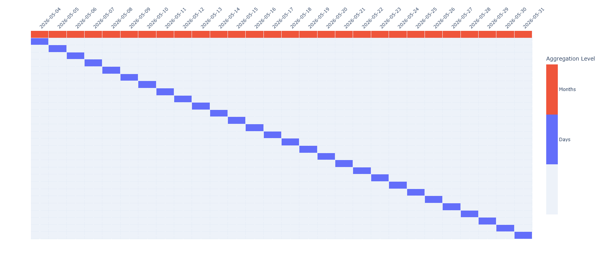

#### Minimal+Weeks

This hierarchy contains weekly aggregations on top of daily and monthly

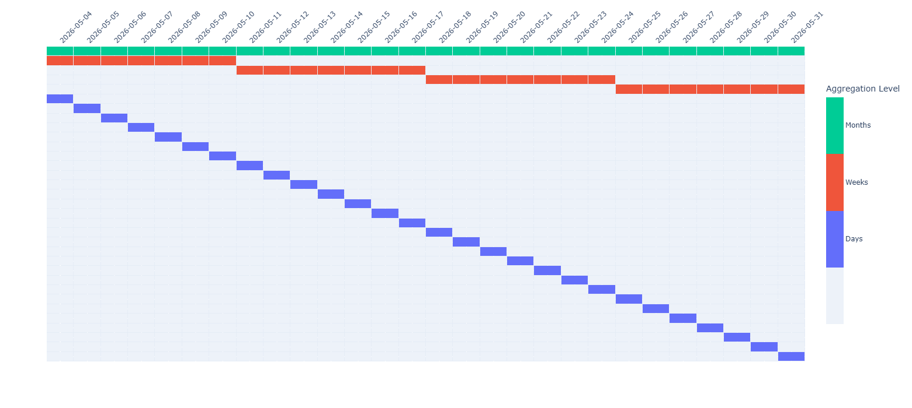

#### Weekends+Weekdays

This hierarchy builds on top of the last one, adding the weekdays and weekends aggregations to the hierarchy.

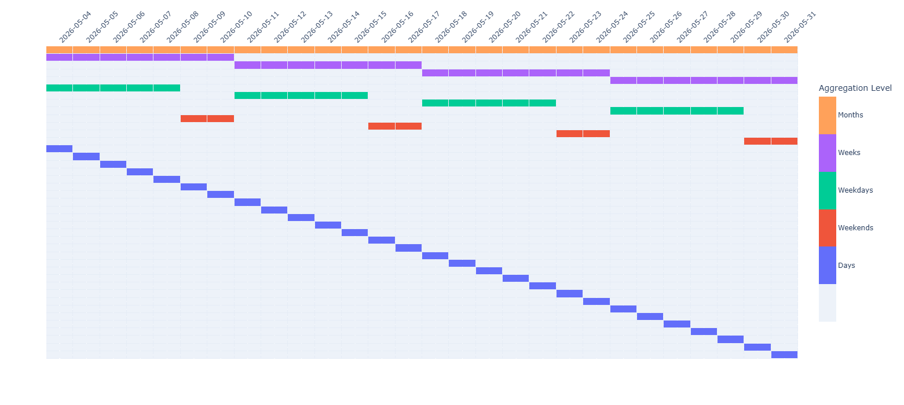

#### Weeks+Biweeks

This hierarchy still builds on Minimal+Weeks, by adding a biweekly/fortnights aggregation level.

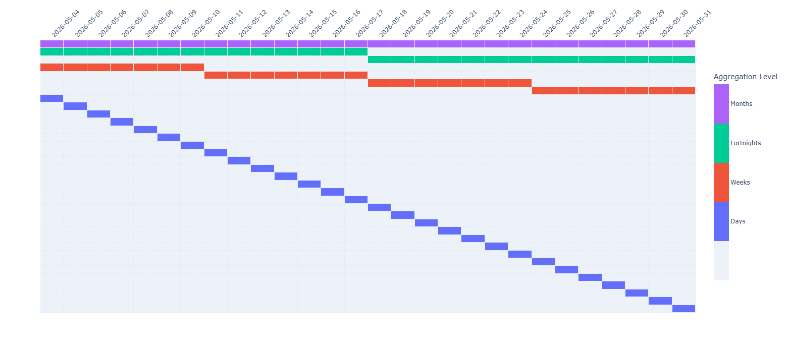

#### Semantic

This hierarchy consists of the most levels of aggregation, and is a union of all other. On top of daily and monthly forecasts, it contains: weekdays, weekends, weeks, fortnights/biweeks. The name came from the idea that this hierarchy contains all aggregation levels which make semantic sense for why those intervals are aggregated.

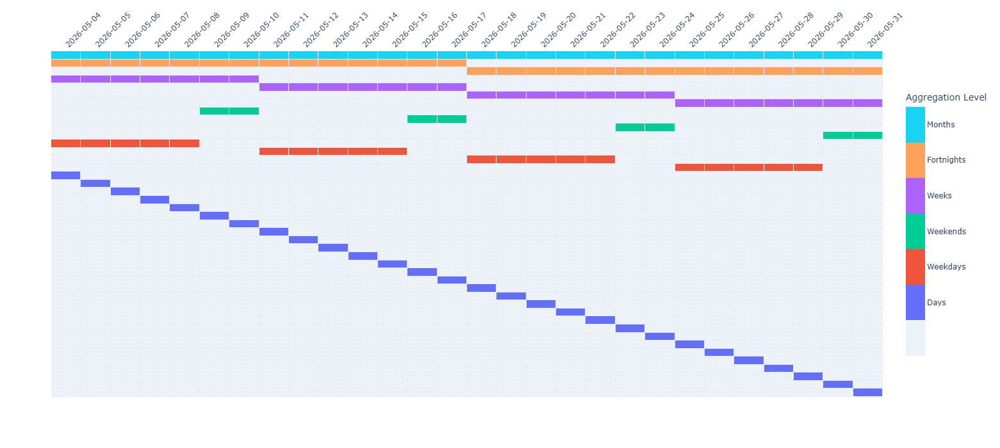

After having defined the hierarchies, forecasting and reconciling was done, as it was explained in the intro, then error metrics were calculated to work with them

The findings showed here only contain the most interesting facts and plots, it is not meant to be comprehensive. Anything that is common among the hierarchies is not considered interesting, because we focus on the differences between hierarchies. I will mention what was left out of this draft at the end of each subsection.

\newpage

### Error distribution and statistics

In this section we look at the raw distribution and some statistics of reconciled and base forecasts across all baseline hierarchies.

#### Error statistics

First checking the statistics of the NRMSE errors across hierarchies in both daily and monthly granularity, comparing the base and reconciled performance.

##### Days

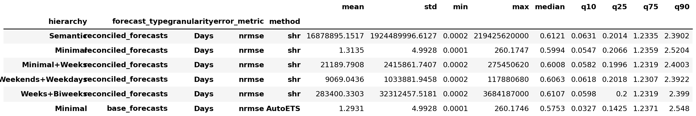

Here we can see that at daily granularity, the median error across the different hierarchies are roughly the same, all of them being higher than the base forecast error median (the same is true for percentiles up until the 75th). The mean is single digit only at the base forecasts and at the minimal hierarchy, where we can see from the max value that no new significant outlier was introduced, unlike other hierarchies, which all have extreme outliers above the 90th percentile which make the mean and variance of the errors meaningless and uncomparable.

We must note that `Minimal` hierarchy achieved the best median error after reconciliation.

##### Months

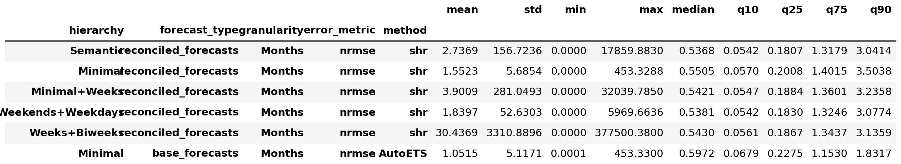

At monthly granularity we can see that the medians across the different hierarchies are similar still, but they are all improvements compared to the base forecast error. We can see worsening of reconciled forecasts only at the 90th percentile. It is clear that outliers were present in the base forecasts as well, and in most hierarchies, except Minimal, they were all 'amplified'. The mean and variance are still uncomparable due to extreme outliers present.

We can note that the `Semantic` hierarchy achieved the best median error after reconciliation. But it is also worth noting that `Minimal` lacks extreme outliers at monthly granularity too.

#### Error Distributions

When making plots from the error data, I frequently filtered out the extreme outliers to make the plots easier to comprehend. This was done but cutting off the values greater than a certain quantile (i.e. 0.99 or 0.999). For simplicity, I will not mention this in the future, except if it is especially important.

##### QQ Plots

In this section I will look at various QQ plots to compare distributions between errors of different kinds. First I will look at the relationship between the reconciled errors in the same hierarchy at the daily and monthly granularity level. The two hierarchies showcases here will be `Semantic` and `Minimal` since there was not much visible difference between the hierarchies, and these two are the two most extreme (all possible aggregations vs. none).

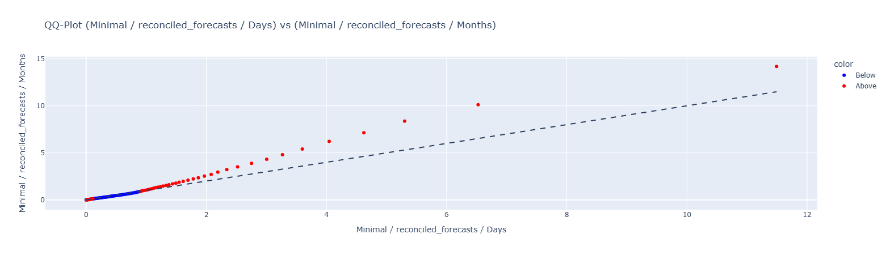

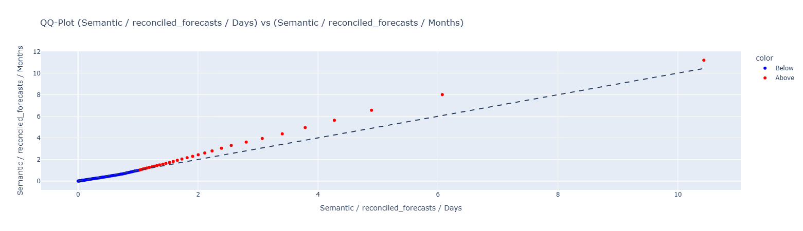

All the hierarchies look rather similar in this regard, with matching error magnitudes at the beginning, then the monthly error quantiles slowly increasing. Notibly `Minimal` has the biggest gap from the identity line, meaning the biggest monthly error percentiles in function of daily percentiles.

##### Histograms

To keep the paper concise and easy to understand I will only display the histogram of the base forecasts, and the reconciled forecasts by `Minimal` and `Semantic`. All other hierarchies proved to not be so different from these two hierarchies, at least not visibly.

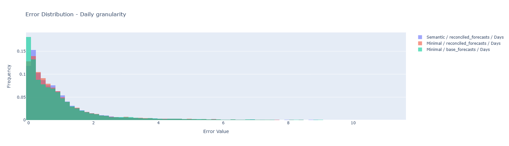

Evidently the unreconciled base forecasts have the most low errors. The two reconciliations produced similar distributions, but `Minimal` has the higher peak at the first step, and `Semantic` has the higher at the next.

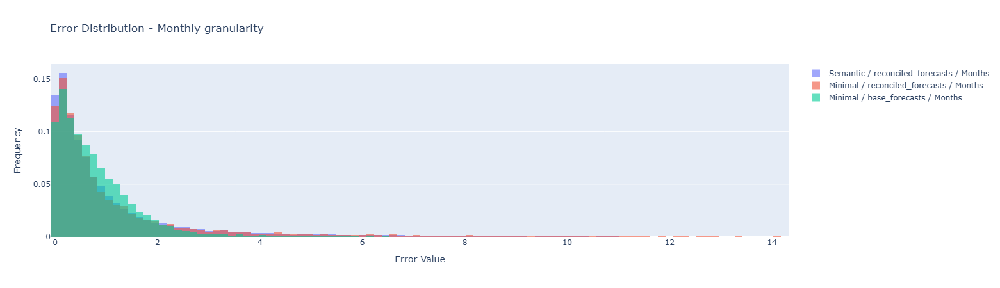

On monthly level, `Semantic` outperforms `Minimal`, with higher skewness. Visibly both hierarchies improved the distributions from how it was unreconciled, but `Semantic` concetrated the errors at low values better.

##### Heatmaps

Here I look at the density heatmap of the joint distribution of daily and monthly errors, before reconciliation, and after reconciliation by `Semantic` and `Minimal` hierarchy.

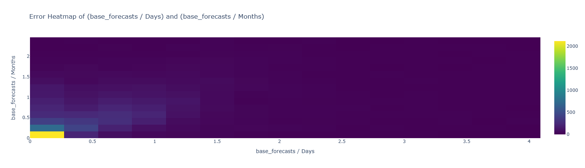

We can see two slight lines of trends/density: one going from the origin in the direction of the identity line and one from the origin straight up. This means there are two main cases: when the daily error roughly matched the monthly, and when the daily error stayed low no matter the monthly.

Here, both hierarchies look more or less the same, but in these reconciled cases (unlike the base forecast case) the only trend line visible is the identiy line, meaning the reconciled errors at the two granularities roughly match.

#### Conclusions

During the research, it was obvious how in each aspect, the two extremes were always `Semantic` and `Minimal`, hence only their traits are listed here as important findings

##### Semantic

- Pros
    - When looking at monthly granularity reconciled forecast errors, this hierarchy had the lowest median and other percentiles, across all hierarchies.
- Cons
    - When looking at daily granularity reconciled forecast errors, this hierarchy had the highest median, across all hierarchies.

##### Minimal

- Pros
    - When looking at daily granularity reconciled forecast errors, this hierarchy had the lowest median, across all hierarchies.
- Cons
    - When looking at daily granularity reconciled forecast errors, this hierarchy had the highest median, across all hierarchies.
    - When looking at QQ plots of the monthly vs. daily reconciled forecast errors, this hierarchy had the biggest gap from the identity line, signaling much bigger monthly errors than daily ones

#### Dead Ends

The following investigations led to no meaningful conclusions and therefore were not included in the paper.

- Plots involving intermediate hierarchies between `Minimal` and `Semantic`
- QQ plots showing base vs. reconciled errors
- Scatters plots of joint distributions of daily and monthly errors
- Statistics after only filtering for only extreme outliers
- Looking for correlation between the base forecast incosistency and reconciled errors

\newpage

### Error differences

Here in this section we calculate the differences in errors from the base forecast errors, for all hierarchies, then analyising these differences. These can be interpreted as the changes made to the error metrics by reconciliation, which are either improvements or detriments.

#### Difference statistics

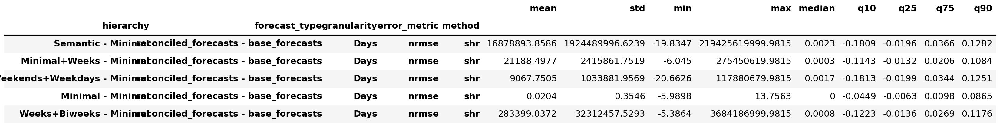

On daily level the median of the change is slightly positive in all hierarchies, meaning more than half the time, the errors increased. Due to the outliers in the positive range the mean and variance are meaningless to look at. Note that it does make sense that there are no outliers with negative sign.

The smallest median difference is with `Minimal` hierarchy. Also this hierarchy does not have any extreme outliers in terms of error difference, proven by the max and also the 90th percentile.

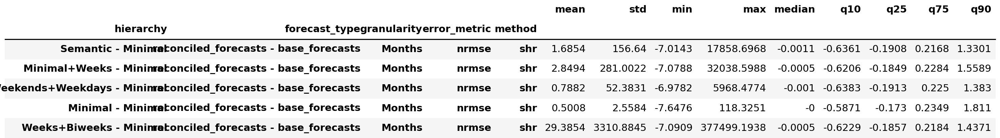

On months level the median change is always negative, meaning more than half the cases, there was in improvement made to the errors.

The best median improvements on monthly granularity come from the `Semantic` hierarchy. It also has the smallest 90th percentile.

#### Filtered statistics

Now we check the statistics of the errors, but after filtering them for positive and negative values to try and get more information.

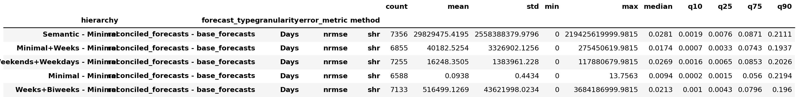

For positive only differences at daily granularity, `Minimal` has the lowest mean and median and variance, as we already suspected from the plots and previous stats. `Semantic` hierarchy has the worst median at daily granularity positive error diffs/ From the counts we can see that the lowest number of error increases at daily granularity happened with `Minimal` hierarchy

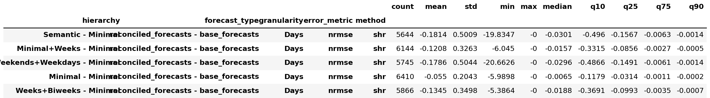

As for negative diffs on daily granularity, the lowest median is with `Semantic` hierarchy. The biggest value (so the worst median) is with the `Minimal` hierarchy. `Minimal` has the biggest number of improved errors. We already saw from the plots that Minimal hierarchy had a consistent, but not very great performance at daily granularity. We can see from the counts that `Semantic` had the lowest number of improvements in difference.

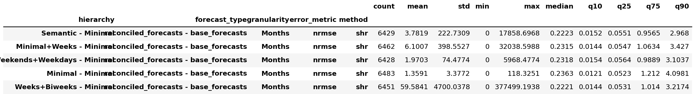

On monthly level, in terms of positive changes the medians are very similar across the different hierarchies. From the 90th percentiles `Semantic` seems the best. The worst q90 value is at the `Minimal` hierarchy. It is interesting to see how consistent the number of positive diffs are, across all hierarchies, there are roughly 6400.

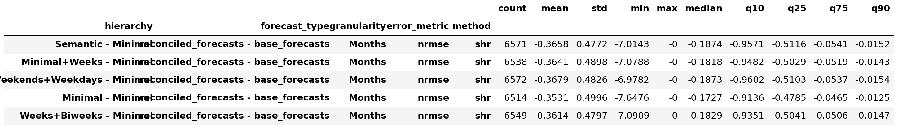

In terms of negative differences (improvements) at monthly granularity, the medians look very similar still. From the 75th percentile we can see that `Minimal` performs the worst, and `Semantic` performs best.

#### Error Difference Sign Distribution

In this section I will look at the heatmaps visualising the cases of the joint distribution of the sign of error differences at monthly and daily granularity for `Minimal` and `Semantic` hierarchy, because these two were the most different two extremes.

If we compare the counts of samples in the 4 cases across the two hierarchies, it is clear that with the `Minimal` hierarchy the cases where the errors at both granularity increased were half as much as they were in `Semantic`. There were 50% more cases where both the errors decreased with `Semantic` hierarchy. There were roughly the same amount of time series where the signs of changes were (+,-) and (-,+) with the `Minimal` hierarchy. The cases where the daily error increased and monthly decreased were far more than cases where daily error decreased while monthly increased with the `Semantic` hierarchy.

#### Error differences vs. Base errors

I will plot the differences of the errors the following way: on the X axis will be the base error values and on the y the difference made to the base error in a specific hierarchy, after filtering both axes for below the 99th quantile (to make the plots more understandable). The two hierarchies I will show in this draft are `Minimal` and `Semantic`, both at the two granularities separately.

It's interesting that the negative differences are very low in absolute value and quite sparse compared to how it is in the monthly metrics (next plots). It seems it's hard for the reconciliation to reconcile these high granularity samples. There almost aren't any negative differences which would match the x = -y axis (meaning the error was decreased to almost none)

When we look at the positive differences, both hierarchies look roughly the same. The negative changes are very sparse for the `Minimal` hierarchy, which must mean that the positive differences were wery low over all, to make the hierarchy achieve the lowest median error after reconciliation on daily granularity.

The overall shapes look very similar for both hierarchies. We must remember that Minimal had no huge outliers to filter out. In negative diffs, unlike at daily granularity, we can see how the maximum amount of negative difference was achieved consistently in each hierarchy, this is seen by tracing a -y=x axis, which the outline of the green dots follow.

#### Conclusions

Across all hierarchies, the median of error differences was slightly positive at daily granularity (meaning errors increased more often than not), and negative at monthly granularity (meaning errors improved more often than not). In both cases, Minimal was on the edge of these trends, meaning it had lowest absolute value medians. At daily granularity, the negative differences did not follow the x = -y line and were sparse and small in absolute value, unlike at monthly granularity where the negative differences consistently traced the x = -y axis. The count of positive error differences at monthly granularity was roughly the same across all hierarchies.

#### Semantic

- Pros
	- When looking at monthly granularity error differences, this hierarchy had the lowest median and the lowest quantiles above the 50th percentile, across all hierarchies.
	- When looking at negative (improved) daily error differences, this hierarchy had the lowest quantiles, meaning the deepest improvements at daily granularity.
	- When looking at monthly positive error differences, this hierarchy had the lowest values from the 75th percentile upward.
	- When looking at monthly negative error differences, this hierarchy had the best (lowest) values from the 25th percentile downward.
- Cons
	- When looking at daily granularity error differences, this hierarchy had the highest median, across all hierarchies.
	- When looking at positive daily error differences, this hierarchy had the highest quantiles, meaning the largest error increases at daily granularity.
	- When looking at the count of positive daily error differences, this hierarchy had the highest count, meaning errors increased most frequently at daily granularity.
	- When looking at the count of negative daily error differences, this hierarchy had the lowest count, meaning the fewest improvements at daily granularity.

#### Minimal

- Pros
	- When looking at daily granularity error differences, this hierarchy had no outliers, as confirmed by the max and 90th percentile values.
	- When looking at daily granularity error differences, this hierarchy had the lowest quantiles and the lowest absolute values overall.
	- When looking at positive daily error differences, this hierarchy had the lowest quantiles and standard deviation, meaning the most contained error increases.
	- When looking at the count of positive daily error differences, this hierarchy had the lowest count, meaning errors increased least frequently at daily granularity.
	- When looking at the count of negative daily error differences, this hierarchy had the highest count, meaning the most improvements at daily granularity.
	- When looking at the error sign distributions, this hierarchy had the lowest number of cases where both daily and monthly errors increased (positive-positive).
- Cons
	- When looking at monthly granularity error differences, this hierarchy had the highest (worst) median, across all hierarchies.
	- When looking at negative daily error differences, this hierarchy had the highest (worst) quantiles, meaning the shallowest improvements at daily granularity.
	- When looking at monthly positive error differences, this hierarchy had the highest median.
	- When looking at monthly negative error differences, this hierarchy had the worst quantiles, meaning the shallowest monthly improvements.
	- When looking at the error sign distributions, this hierarchy had the lowest number of cases where both daily and monthly errors decreased (negative-negative).
	- When looking at the error sign distributions, this hierarchy had roughly equal counts of positive-negative and negative-positive sign changes, indicating many mixed-direction changes between daily and monthly granularity.

\newpage

### Semantic vs. Minimal

In all past sections we have seen the same trend, that whatever was the scale/metric, at opposite ends stood `Minimal` and `Semantic` hierarchy, meaning in most cases they seemed to work in a contrary way, where on performed better, the other performed worse and vice versa. Other hierarchies stayed in the middle, they never stood out, neither from the mentioned two hierarchies, nor from each other, i.e. they were rarely distinguishable from each other.

For these reasons, in this last subsection I compare the performance of these two hierarchies specifically. This allows me to make plots which would have been overwhelming or even unfeasible when dealing with five hierarchies.

#### QQ plots

**Reconciled Forecasts**

First I look at QQ plots comparing the distributions of the reconciled forecasts from the two hierarchies, at daily and monthly granularity separately. In both plots the outliers are filtered out for higher clarity.

At daily granularity we can see that the first few percentiles are (very slightly) better with the `Minimal` hierarchy, but otherwise the distributions are quite similar, with slight improvements at higher percentiles/errors. We have already seen that the sheer volume of outliers are not smaller with `Minimal` hierarchy, in fact they are slightly bigger, hence why the later percentiles show `Semantic` as better.

At monthly granularity there is no percentile where `Minimal` would be better, and we can see progressively improving percentiles with `Semantic` hierarchy. This suggests a notion that adding hierarchy levels could improve the top level accurarcy, which we will explore later.

**Error differences**

Next I look at QQ plots comparing the error differences of the hierarchies

From this plot we can deduce that in cases where there were great improvements to daily granularity errors, `Semantic` performed better, with greater reductions. When the daily error increased, then `Semantic` performed worse, by increasing the errors slightly more than `Minimal`.

From the same plot but with monthly granularity we can see that basically each percentile is smaller for `Semantic` hierarchy, meaning it reduced the errors more effectively, and increased them less. This further reinforces that `Semantic` performed better at the monthly granularity level.

#### Hierarchy error differences

Next I examine the differences between the reconciled forecasts themselves, substracting the errors of `Minimal` from that of `Semantic`, to essentially get the error change we get when swapping hierarchies. (so far we only looked at the differences made from the base forecasts by reconciliation)

**QQ plot**

We can clearly see here that at the lower percentiles, monthly granularity error is decreased more than daily, and at higher percentiles they more or less match.

**Histogram**

From the histogram of the error differences at daily and monthly granularity, we can see how there were many cases of slightly positive daily differences (meaning worse predictions by `Semantic`), with more big monthly improvements at the negative end.

**Error difference sign distributions**

It is apparent that in almost half the cases, `Semantic` decreased the error at both granularities, while at a third of the cases, it increased both erros. There were three times as much cases when monthly error decreased while daily increased, than there were when daily error decreased, while monthly increased. Just over 50% of cases showed improvements to daily granularity errors, while almost two thirds of cases showed improvements to monthly granularity errors when going from `Minimal` to `Semantic` hierarchy.

#### Error statistics, outlier filtered out

Let us look back at the plain statistics of the reconciled forecast errors of both hierarchies, but now with the top 1% of values filtered out, to make the mean and variance statistics more reliable and meaningful, without the extreme outliers' distortion.

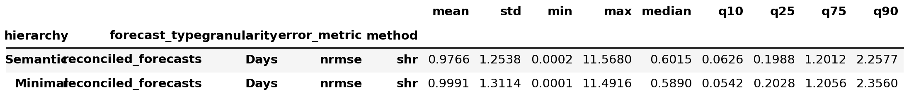

From the daily error filtered statistics, we can still see that `Minimal` achieved slightly lower median error (with other qunatiles going back and forth, as we have already seen from the QQ plots), but it in fact achieved worse mean error, by a slight difference. The variances of the errors are very similar, with slighly higher one for `Minimal`

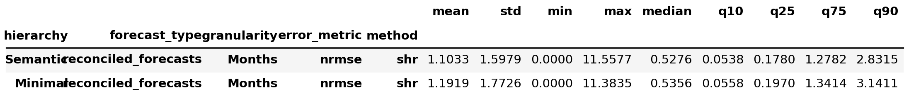

At monthly granularity, `Semantic` achieves lower median error, lower mean error and lower variance (by a much bigger margin). All other percentiles favor `Semantic` also, as we have already seen in the QQ plots.

#### Conclusions

In terms of the distributions of the signs of differences between `Semantic` and `Minimal` reconciled forecast, there were three times as many cases where the monthly error decreased while the daily error increased, than there were cases where the daily error decreased while the monthly error increased.

**Semantic**

- Pros
    - When looking at the QQ plot of monthly reconciled forecast errors, this hierarchy was favored at all but the first dozen percentiles, with the margin growing progressively larger at higher errors.
    - When looking at the QQ plot of daily error differences vs. base forecasts, this hierarchy had lower negative difference percentiles by a large margin, meaning deeper improvements.
    - When looking at the QQ plot of monthly error differences vs. base forecasts, this hierarchy had lower percentiles by a growing margin across the distribution.
    - When looking at the QQ plot of monthly outliers, this hierarchy achieved lower percentiles.
    - When looking at the hierarchy error difference (Semantic minus Minimal reconciled forecast errors), the median was negative at both daily and monthly granularity, meaning `Semantic` achieved lower errors more than half the time.
    - When looking at the QQ plot of hierarchy differences, the monthly differences were smaller (more negative) than daily at most lower quantiles, becoming uniform at higher quantiles.
    - When looking at the hierarchy difference statistics with outliers filtered, the monthly mean and median were significantly negative, confirming `Semantic`'s advantage at monthly granularity.
    - When looking at the plain reconciled forecast error statistics with outliers filtered, all monthly statistics (mean, median, variance, percentiles) favored this hierarchy.
- Cons
    - When looking at the QQ plot of positive daily error differences vs. base forecasts, this hierarchy had greater percentiles, meaning larger error increases at daily granularity.
    - When looking at the hierarchy difference statistics with outliers filtered, the daily mean and median were negative but extremely small in absolute value, meaning the advantage over `Minimal` at daily granularity was negligible.
    - When looking at the histogram of hierarchy differences, there were many cases where the daily error slightly increased (positive differences).

**Minimal**

- Pros
    - When looking at the QQ plot of daily reconciled forecast errors, most low percentiles were favored by this hierarchy.
    - When looking at the plain reconciled forecast error statistics with outliers filtered, the daily median was slightly smaller for this hierarchy.
- Cons
    - When looking at the plain reconciled forecast error statistics with outliers filtered, the daily mean was slightly bigger and the variance slightly higher for this hierarchy — only the lower percentiles were favored.
    - When looking at the hierarcy error difference sign distributions, just over 50% of cases showed a bigger daily error, and roughly two thirds of cases showed a greater monthly error compared to `Semantic`.

#### Dead Ends

The following investigations led to no meaningful conclusions and therefore were not included in the paper.

- Scatter plots of errors and error differences
- Hierarchy differences plotted as function of base
- Heatmap of joint distribution
- QQ plot of outliers only
- Looking for correlation between base forecast incosistency and hierarchy differences

\newpage

### Baseline Hierarchy Conclusions

After the thorough analysis of NRMSE errors was done, the three other error metrics, `1-R2`, `WAPE` and `MASE` were similarly investigated, but overall, they showed the same characteristics. They mostly differed only in the amount and magnitude of their extreme outliers, but other than that, they behaved the same as `NRMSE` did. Because of this, they are not discussed in this paper, neither in this chapter, nor later on.

As we saw in all subsections, the two prevalent extremes in all aspects were always `Semantic` and `Minimal` hierarchy. Other hierarchies consistently stayed in the middle and were rarely distinguishable from each other. This is why in these conclusions I only discuss traits of these two hierarchies' reconciliations.

#### Overall finding - a granularity trade-off

Reconciliation with `Semantic` hierarchy consistently improved monthly granularity errors at the cost of daily granularity, while `Minimal` hierarchy preserved daily granularity accuracy at the cost of monthly. This trade-off was visible across every analysis performed — plain statistics, error differences, outliers, and direct head-to-head comparison, both in terms of joint distributions and independent distributions. This difference in daily error, however, is very subtle, so the effect may be viewed as just an improvement to monthly granularity errors with `Semantic` hierarchy.

Across all hierarchies, the median error difference of reconciled forecasts vs. base forecasts was slightly positive at daily granularity (errors worsened) and negative at monthly granularity (errors improved). `Minimal` was always on the edge of both trends, having the lowest absolute value medians. At daily granularity, negative error differences were sparse and did not follow the x = -y line, unlike at monthly granularity where they consistently traced it — meaning reconciliation could fully eliminate monthly errors in some cases, but rarely/never did so for daily ones.

Next I will list comprehensive and concise findings about the hierarchies, with the proofs in brackets.

#### Traits of Semantic hierarchy

**Monthly granularity strengths:**

- Lowest reconciled forecast error median and percentiles across all hierarchies (plain statistics, QQ plots).
- Lowest error difference median and quantiles above the 50th percentile vs. base forecasts; lowest monthly positive difference percentiles from p75 upward; deepest monthly negative differences from p25 downward (error difference statistics).
- Best monthly outlier mean and percentiles across all reconciled hierarchies (outlier statistics).
- In the head-to-head comparison, all monthly statistics (mean, median, variance, percentiles) favored `Semantic` after outlier filtering, with the hierarchy difference having a significantly negative monthly mean and median (Semantic vs. Minimal section).

**Daily granularity weaknesses:**

- Highest reconciled forecast error median across all hierarchies (plain statistics).
- Highest daily error difference median vs. base forecasts; highest positive daily difference quantiles; highest count of daily error increases and lowest count of daily improvements (error difference statistics).
- In the head-to-head comparison, the daily advantage over `Minimal` was negligible — the hierarchy difference mean and median were negative but extremely small in absolute value, and the histogram showed many cases of slight daily error increases (Semantic vs. Minimal section).

#### Traits of Minimal hierarchy

**Daily granularity strengths:**

- Lowest reconciled forecast error median across all hierarchies (plain statistics, QQ plots at low percentiles).
- No outliers in daily error differences (confirmed by max and p90); lowest daily difference quantiles and absolute values overall; lowest positive daily difference quantiles and standard deviation; lowest count of daily error increases and highest count of daily improvements (error difference statistics).
- Lowest number of cases where both daily and monthly errors increased simultaneously (error sign distributions).

**Monthly granularity weaknesses:**

- Biggest gap from the identity line on monthly vs. daily QQ plots, signaling much bigger monthly errors than daily ones (plain error QQ plots).
- Highest monthly error difference median vs. base forecasts; highest monthly positive difference median; shallowest monthly negative differences (error difference statistics).
- In the head-to-head comparison, just over 50% of cases showed bigger daily errors and roughly two thirds showed greater monthly errors compared to `Semantic` (error sign distributions).

**Error sign distributions:**

- Lowest positive-positive count (fewest cases where both granularities worsened), but also lowest negative-negative count (fewest cases where both improved). Roughly equal positive-negative and negative-positive counts, indicating many mixed-direction changes. In the head-to-head comparison, where the hierarchical reconciled forecast error differences were examined (meaning Semantic minus Minimal difference), there were three times as many cases where the monthly error decreased while the daily increased, than the reverse (error sign distributions, Semantic vs. Minimal section).

\newpage
