## Binary hierarchies

In the previous chapter, we observed a consistent pattern: `Semantic` hierarchy (with the most aggregation levels among the base hierarchies) achieved the best monthly granularity performance, while `Minimal` (with the fewest levels) preserved daily granularity accuracy. Other hierarchies fell in between, roughly ordered by the number of aggregation levels they contained. This suggested a notion that adding more intermediate aggregation levels could further improve top-level (monthly) accuracy.

To explore this, two new hierarchies are introduced in this chapter: `Binary` and `Full`. Unlike the base hierarchies, which used only semantically meaningful aggregation intervals (weeks, fortnights, weekdays, weekends), these new hierarchies include arbitrary aggregation levels — intervals that do not correspond to any natural calendar period, but instead subdivide the 28-day month in a roughly binary fashion. The `Full` hierarchy is a union of all levels from both the base and binary approaches, making it the largest hierarchy tested.

The goal of this chapter is to determine whether the trend observed in the base hierarchies — that more aggregation levels improve monthly accuracy — continues when we push the number of levels further, and whether the daily granularity trade-off remains acceptable. The findings here will inform the direction of the next chapter: if the trend holds, we will investigate it systematically with many randomly sampled hierarchies of varying sizes; if it breaks down, we will instead focus on understanding why.

The workflow is the same as in the base hierarchies chapter: the same dataset, the same 13k time series subset, the same train/validation split, the same AutoETS base forecasts, and the same shrinkage-based minT reconciliation. The only difference is the set of hierarchies being compared. We continue to evaluate NRMSE errors at daily and monthly granularity.

The investigations shown here will be only a subset of what was present with the baseline hierarchies. Those plots/tables which did not provide further insights were left out. The main focus of this chapter will be to use these 4 highly different hierarchies (the baseline hierarchies proved to be too similar to each other) to see traces of error trends that might follow by having more and more aggregation levels.

### Defining the hierarchies

Four hierarchies are compared in this chapter. `Minimal` and `Semantic` are carried over from the base hierarchies chapter as reference points. `Binary` and `Full` are new. Let us see their summing matrix for better understanding.

#### Minimal

This hierarchy contains only daily and monthly aggregation levels. It serves as the baseline with the fewest levels.

#### Semantic

This hierarchy contains all aggregation levels which make semantic sense: weekdays, weekends, weeks, and fortnights, on top of daily and monthly. It was the best monthly performer among the base hierarchies.

#### Binary

This hierarchy contains a semi-binary structure of aggregation, starting from 28 leaves, up to a single root. It would require a month to be 32 days for a perfect binary structure, but we can still achieve an almost complete binary tree with 4 missing leaves.

#### Full

This hierarchy is a union of `Semantic` and `Full`

### Error statistics

First I will look at the statistics of the reconciled forecast errors per hierarchy and granularity.

#### Daily

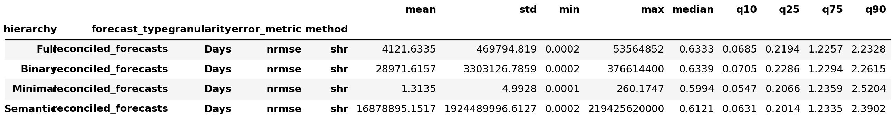

Looking at daily granularity error statistics, we can see that the two new hierarchies did introduce extreme outliers, so the means and variances are not comparable. Note that these outliers' magnitudes are several orders of magnitude smaller still.

From the medians, it's visible that the two new hierarchies did not worsen the performance much when looking at the medians. There is very little difference between the median of `Full` and `Binary`. Their q75 and q90 percentiles are smaller than either `Minimal`'s or `Semantic`'s, which suggests generally smaller big errors. Where these hierarchies are significantly lacking, are the smaller percentiles, where they achieve significantly bigger values, meaning bigger small errors.

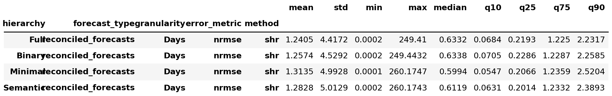

When sorting out the super extreme outliers, we can get some more meaningful insights from the means and variances.

When looking at the means, `Full` hierarchy performs best. Though there is not a huge difference between the means, it still seems like having more aggregation levels decreases mean error, but increases median error at bottom level granularity. The variances are also the smallest with `Full` hierarchy, with `Binary` being a close second.

#### Monthly

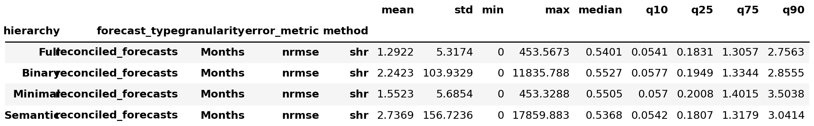

Looking at monthly granularity error statistics, it is apparent how big the differences are in the means. `Full` hierarchy achieved the best value, being half as much as `Semantic`'s mean, and also being smaller than `Minimal`'s mean, which we know is not distorted by super extreme outliers. `Full` itself did not introduce any extreme outliers, as it is apparent by the maximum value. This produces an undistorted variance value, which is smaller than `Minimal`'s.

`Full` performs better than `Binary` at all percentiles, also achieving a global minimum with q75 and q90 percentiles. The median stayed the smallest for `Semantic` hierarchy, but `Full` is not lacking much, and is better than `Minimal`'s.

The worst performance out of these hierarchies is still `Minimal`, which also lost it's advantage of being the only hierarch not producing extreme outliers.

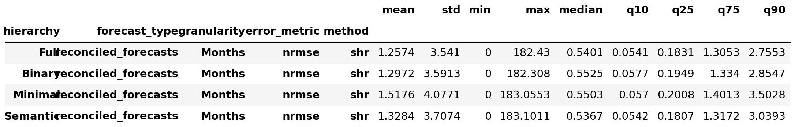

When sorting out the extreme outliers, we more reliably compare the means and variances. Still `Full` has the smallest mean monthly error, and also the smallest variance.

#### Conclusions

The median values across the four hierarchies were relatively close at both granularities, so the differences between hierarchies are more visible in the means, variances, and upper percentiles. `Full` emerged as the strongest overall performer in this section, while `Minimal` remained the weakest.

##### Full
- Pros
    - When looking at monthly granularity reconciled forecast errors, this hierarchy had the lowest mean and variance (both raw and after filtering extreme outliers), and the lowest q75 and q90 percentiles, across all hierarchies.
    - When looking at daily granularity reconciled forecast errors (after filtering extreme outliers), this hierarchy had the lowest mean and variance, and the lowest q75 and q90 percentiles, across all hierarchies.
- Cons
    - When looking at monthly granularity reconciled forecast errors, this hierarchy had a worse median than `Semantic`, though still better than `Minimal`.
    - When looking at daily granularity reconciled forecast errors, this hierarchy had bigger q10 and q25 percentiles than all other hierarchies, meaning larger small errors.

##### Likely trends
- Improving with more levels:
    - Monthly mean and variance
    - Daily mean and variance
    - Monthly and daily q90
- Worsening with more levels:
    - Daily median
    - Monthly median

#### Dead Ends

The following investigations led to no meaningful conclusions and therefore were not included in the paper.

- Histograms of error distributions
- QQ plot of error distributions
- Searching for correlation between base forecast incoherence

### Error differences

This section is about analysing the differences made to errors by reconciliation of the four hierarchies.

#### Error sign distribution

Here I look at the joint distributions of the signs of differences at daily and monthly granularity, per each hierarchy.

By a little margin, `Full` has the most amount of negative-negative difference signs, but also the most amount of positive-positive changes. This hierarchy also has the most amount of daily positive changes (60%). Monthly positive changes on the other hand are consistent across the hierarchies.

#### Error difference statistics

Next we look at the statistics of the error differences, both raw (but with top 0.01% outliers filtered out) and filtered by signs. First we look at the complete statistics at monthly then daily granularity, and afterwards I look at the statistics of the error differences, after sorting out only positive/negative differences at monthly and daily granularity separately.

##### Daily error differences

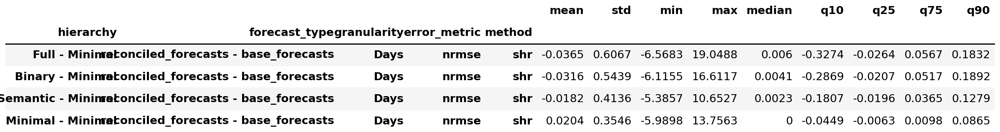

Looking at daily error difference statistics, with outliers sorted out, `Full` has the smallest mean, the highest variance, and biggest median. In terms of the mean, variance, and median, a trend can be observed between the four hierarchies: `Full` favored by lowest mean, `Minimal` favored by lowest median, and vica versa.

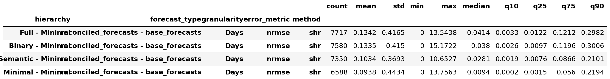

When looking at daily positive error differences, with outliers sorted out, we can see that `Full` has the most amount of cases (as we already saw in the heatmap matrix), with a visible trend across the four hierarchies. `Full` also has the largest mean with a visible trend. Variance values look all over the place, with `Semantic` having the smallest. In terms of median values, there is a visible trend, with `Full` having the largest value.

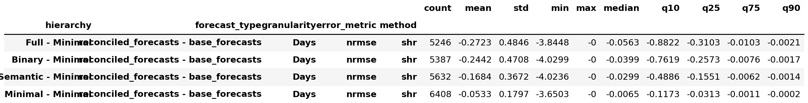

When looking at daily negative error differences, with outliers sorted out, `Full` has the smallest mean, with a visible trend, but it also has the biggest variance, also with a visible trend. `Full` has the smallest median, with an apparent trend, which propagates through basically all the percentiles.

##### Monthly error differences

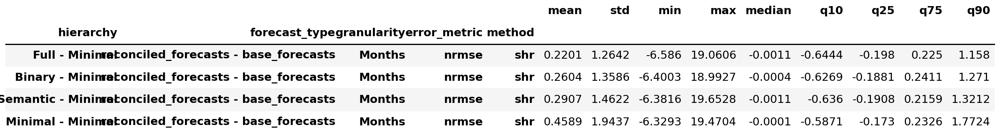

Looking at monthly error difference statistics, with outliers sorted out, `Full` has the smallest mean, smallest variance, second smallest median (with `Semantic` having the smallest). When looking at the progression of mean and variance in order of the hierarchies, a trend can be seen, where the more aggregation levels seem to provide bigger mean error decreases, and lesser variation in the changes.

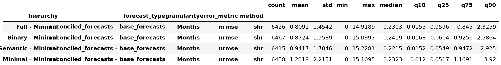

When looking at monthly positive error differences, with outliers sorted out, we can see that the counts of samples are the same between the four hierarchies. `Full` has the smallest mean and variance, both of which have a noticable trend among the hierarchies. The median values are very similar and close across the four hierarchies, but `Semantic` is the smallest. Above the 75th percentile, it seems like a trend favoring `Full` becomes visible.

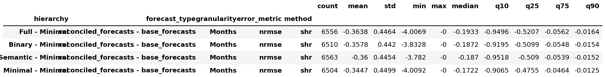

When looking at monthly negative error differences, with outliers sorted out, the mean and variance is very similar across the hierarchies. `Full` has smallest mean however. It also has the smallest median value, which has a visible trend.

#### Conclusions

##### Full
- Pros
    - When looking at error sign distributions, this hierarchy had the most negative-negative (both granularities improved) cases.
    - When looking at monthly error difference statistics (with outliers filtered), this hierarchy had the smallest mean and variance, and the second smallest median.
    - When looking at daily error difference statistics (with outliers filtered), this hierarchy had the smallest mean and variance.
    - When looking at monthly positive error differences, this hierarchy had the lowest mean and variance.
    - When looking at monthly negative error differences, this hierarchy had the smallest mean and median.
    - When looking at daily negative error differences, this hierarchy had the smallest mean and median.
- Cons
    - When looking at error sign distributions, this hierarchy had the most positive-positive (both granularities worsened) cases, and the most daily positive changes overall.
    - When looking at daily error difference statistics (with outliers filtered), this hierarchy had the biggest median.
    - When looking at daily positive error differences, this hierarchy had the biggest mean.
    - When looking at daily negative error differences, this hierarchy had the biggest variance.

##### Likely trends
- Improving with more levels:
    - Monthly diff mean and variance
    - Daily diff mean and variance
    - Monthly positive diff mean, variance, and q75/q90
    - Monthly negative diff median
    - Daily negative diff mean and median
- Worsening with more levels:
    - Daily diff median
    - Daily positive diff count, mean, and median
    - Daily negative diff variance

#### Dead Ends

The following investigations led to no meaningful conclusions and therefore were not included in the paper.

- Error differences plotted as function of base error

### Full vs. Others

In this section I will compare `Full` hierarchy's performance with others' directly

#### Hierarchy differences

In this section I will analyse the error differences between `Minimal` hierarchy's and `Full`/`Semantic` hierarchy's reconciled forecasts. I call these hierarchy differences.

**QQ plot**

Here I look at QQ plots comparing the distribution of `Full - Minimal` and `Semantic - Minimal` differences at daily and monthly granularity separately.

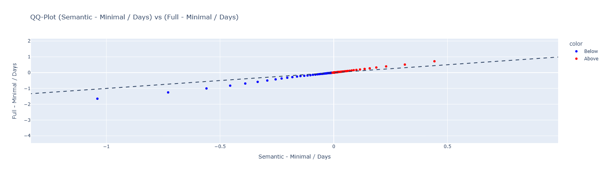

Here the plot is almost a straight line, with negative differences favoring `Full`, and positive differences favoring `Semantic`. This means improvements by reconciliation were magnified by having more aggregation levels, and degradations by reconciliation were also similarly magnified.

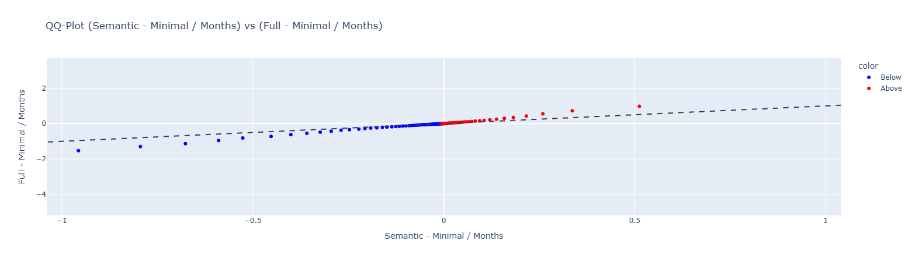

The same can be said at monthly granularity.

**Error signs**

Next I will look at the distribution of the signs of these changes at the two granularities.

Comparing this plot with how it was with `Semantic`:

- D-M- 42.64 vs 44.85
- D+M+ 33.65 vs 30.56
- D+M- 18.1 vs 17.68
- D-M+ 5.61 vs 6.91

- D- 48.25 vs 51.76
- M- 60.74 vs 62.53

We can deduce the amount of negative changes worsened going from `Semantic` to `Full`

I will plot the `Full` vs `Semantic` differences. `Semantic` is treated as the base here, so negative differences favor `Full` hierarchy

Here we can see that in more than half cases, `Full` produced better monthly error, while daily difference sign is almost fiflty fifty. In 40% of the cases, switching hierarchies was a plain improvement.

**Statistics**

Looking at the error difference statistics, with both outlier ends removed, the mean of difference is negative in both granularities, meaning on average, `Full` produced slightly better reconciled forecasts. The median is positive in daily case (as we saw with signs), and negative in the monthly case.

Looking at the statistics of these differences, we can see that the daily median is positive, meaning in more than half the cases, `Full` hierarchy performed worse (unlike how it was with `Semantic`). The mean of difference is smaller than it was with `Semantic`, at both granularities.

The negative error difference percentiles, at both granularities, are smaller for `Full`, and positive ones are smaller for `Semantic`

#### Conclusions

##### Full

- When looking at QQ plots of error differences (`Full` vs `Semantic`), the plots are almost straight lines with higher steepness than the identity, meaning improvements by reconciliation were magnified by having more aggregation levels, and degradations were similarly magnified.
- Pros
    - When looking at hierarchy difference statistics (`Full - Minimal`), the mean of difference is smaller than it was with `Semantic`, at both granularities.
    - When looking at `Full` vs `Semantic` error sign distributions, in 40% of cases switching from `Semantic` to `Full` was a strict improvement at both granularities, and in 55% of cases the monthly error improved.
    - When looking at `Full` vs `Semantic` error difference statistics, the mean is negative at both granularities, meaning `Full` produced slightly better reconciled forecasts on average.
- Cons
    - When looking at hierarchy difference statistics (`Full - Minimal`), the daily median is positive, meaning in more than half the cases `Full` performed worse (unlike `Semantic` which had a negative daily median).
    - When looking at hierarchy difference sign distributions (`Full - Minimal`), there were fewer negative-negative cases and fewer monthly negative changes than with `Semantic`.

#### Dead Ends

The following investigations led to no meaningful conclusions and therefore were not included in the paper.

- Histograms of hierarchy difference distribution
- QQ plot of Full error difference distributions

### Conclusions to Binary Hierarchies

Across all subsections, `Full` hierarchy (with the most aggregation levels) was the strongest performer, while `Minimal` remained the weakest. `Semantic` retained its advantage only in median values. `Binary` consistently fell between `Semantic` and `Full`, rarely standing out on its own. This is why in these conclusions I only discuss traits of `Full`.

#### Overall finding: the trend confirmed

The trend observed in the base hierarchies chapter — that more aggregation levels improve monthly accuracy — has been confirmed and extended. `Full` hierarchy achieved the best means, variances, and upper percentiles at both granularities. The daily granularity trade-off is not as significant as it may have appeared in the base hierarchies chapter: while the daily median worsened with more levels, the daily mean consistently improved as a trend, along with the variance and upper percentiles. The cost of adding more levels is concentrated in the lower percentiles and median at daily granularity, while the overall average error improved.

Compared to `Semantic`, `Full` amplifies both improvements and degradations — when reconciliation helped, it helped more; when it hurt, it hurt more. This was directly visible in the QQ plots of error differences, which formed near-straight lines with steepness greater than the identity.

A trend was observed across multiple metrics when ordering the hierarchies by the number of aggregation levels (Minimal < Semantic < Binary < Full). The following are collected from all subsections.

**Trends improving with more levels:**

- Monthly and daily reconciled error mean and variance (error statistics).
- Monthly and daily reconciled error q90 (error statistics).
- Monthly and daily error difference mean and variance (error difference statistics).
- Monthly positive difference mean, variance, and q75/q90 (filtered error difference statistics).
- Monthly negative difference median (filtered error difference statistics).
- Daily negative difference mean and median (filtered error difference statistics).

**Trends worsening with more levels:**

- Monthly and daily reconciled error median (error statistics).
- Daily error difference median (error difference statistics).
- Daily positive difference count, mean, and median (filtered error difference statistics).
- Daily negative difference variance (filtered error difference statistics).

#### Full hierarchy

**Monthly granularity strengths:**

- Lowest reconciled error mean and variance, and lowest q75 and q90 percentiles across all hierarchies (error statistics).
- Lowest error difference mean and variance vs. base forecasts (error difference statistics).
- Lowest monthly positive difference mean and variance; lowest monthly negative difference mean and median (filtered error difference statistics).
- In the head-to-head with `Semantic`, the mean of `Full - Semantic` difference is negative, and 55% of cases showed monthly improvement (Full vs others section).

**Monthly granularity weaknesses:**

- Worse reconciled error median than `Semantic`, though still better than `Minimal` (error statistics).

**Daily granularity strengths:**

- Lowest reconciled error mean and variance, and lowest q75 and q90 percentiles across all hierarchies (error statistics).
- Lowest error difference mean and variance vs. base forecasts; big daily base errors rarely increased and frequently decreased by a large amount (error difference statistics, error difference plots).
- Lowest daily negative difference mean and median (filtered error difference statistics).
- Most negative-negative (both granularities improved) cases in error sign distributions (error difference sign distributions).

**Daily granularity weaknesses:**

- Bigger q10 and q25 percentiles than all other hierarchies (error statistics).
- Biggest daily error difference median; biggest daily positive difference mean (error difference statistics).
- Most positive-positive (both granularities worsened) cases, and most daily positive changes overall (error difference sign distributions).
- In the head-to-head with `Minimal`, the daily median of `Full - Minimal` difference is positive, unlike `Semantic` which had a negative daily median (Full vs others section).

\newpage
