## Sampled Hierarchies

The trends observed in the baseline hierarchies chapter have been further confirmed: more aggregation levels improve the mean error at both granularities, along with the variance and upper percentiles. Given that these trends hold, this next chapter will investigate it systematically by evaluating many randomly sampled hierarchies of varying sizes, to determine whether the relationship between the number of aggregation levels and forecast accuracy is robust and monotonic.

### Methodology

For simplicity, the only trends which we will be investigating in the future is the one stating that having more aggregation levels (i.e. rows in the summing matrix) decreases the average NRMSE error at both top and bottom level granularity, and slightly increases the median at the same time.

The so called `Sampled Hierarchies` are generated randomly in the following process.

- 24 unique aggregations are defined. These may result in multiple (but not the same amount of) rows in the summing matrix (e.g. weekly aggregation produces 4 rows)
- We randomly draw aggregation levels from this pool, in batches of 3 to produce packs of aggregations containing 3, 6, 9, 12, 15, 18, 21 unique aggregations. Due to the sequential drawing process, each pack is a subset of the next.
- We call a single occurence of pack drawing a `group` of `Sampled Hierarchy`, which this way will contain 7 different hierarchies, with monotonously increasing amounts of rows in their summing matrix.
- The amount of aggregations used in a single hierarchy is called `height`. Therefore a group contains 6 hierarchies with different heights.
- For now, 10 of these groups are produced to make 70 unique hierarchies
- Using the nature of this sampling process we can investigate how well these suspected trends hold up in practice, aggregated across the unique groups, or checking each of them uniquely.

Let's look at the summing matrix of such a `Sampled Hierarchy`

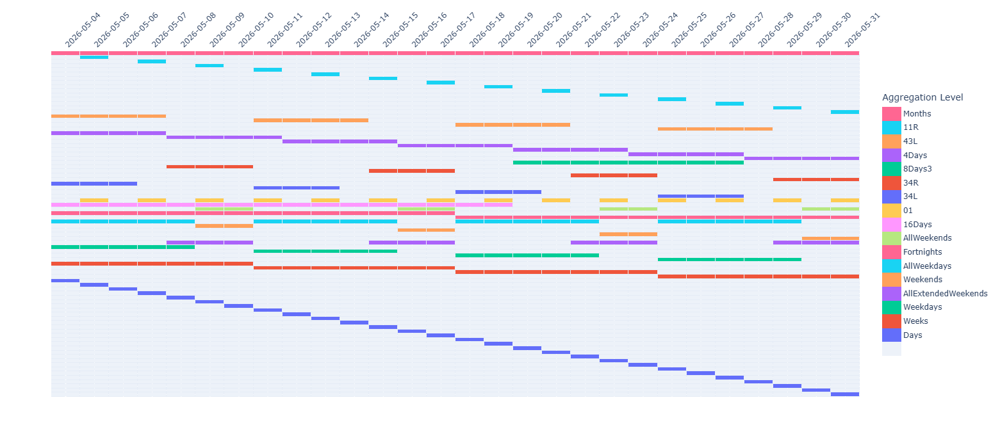

After the hierarchies are defined, the forecasting, reconciliation and error metric calculation happens in the exact same way as before, with the exact same dataset. The statistics of the `NRMSE` error metrics are calculated with the top 0.1% of outliers filtered out in order to make the mean more meaningful.

### Mean trend analysis

First I will plot a matrix showing the mean NRMSE errors of all the unique sampled hierarchies at daily and monthly granularity.

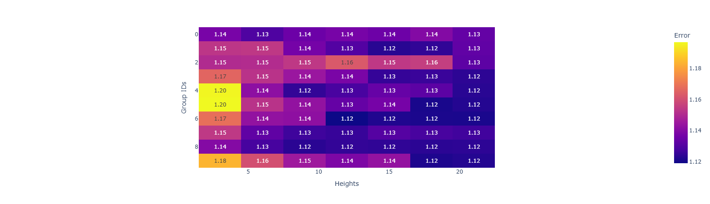

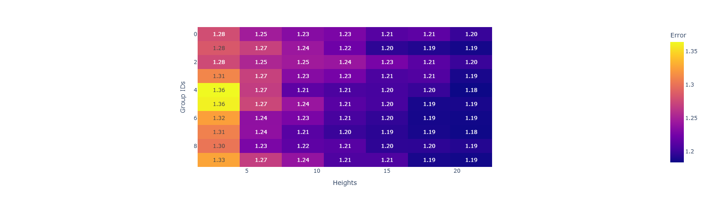

As we can see, at monthly granularity the trend seems very consistent and robust at each individual group, while at daily granularity it still seems more or less true, but way less consistent. To get more insight, I will plot bar charts of various aggregates of the means of individual hierarchies, first for the monthly error mean

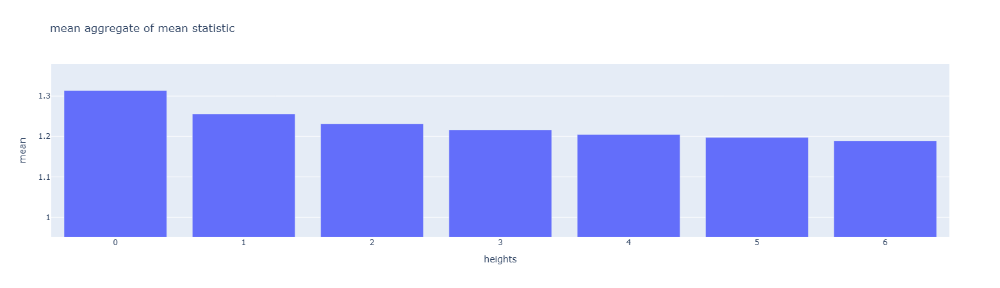

As we can see, the mean aggregate of the mean statistic is consistently decreasing by adding more and more hierarchy levels (at least up to the point of the limit of our available levels).

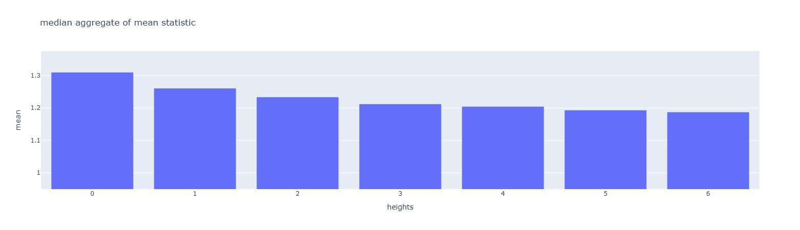

The same is true for the median aggregate of the different means.

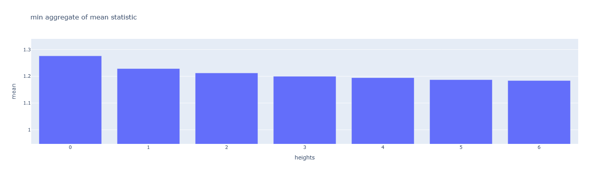

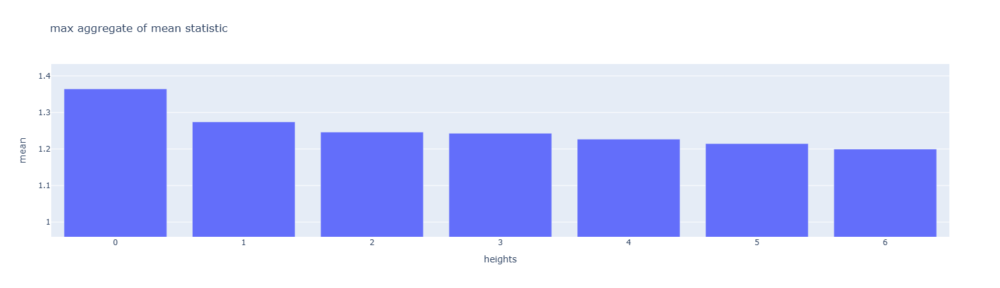

It is very nice to see that the trend still holds for even the minimum and maximum of the individual means.

Now we look at the same charts for aggregates of the mean daily granularity errors.

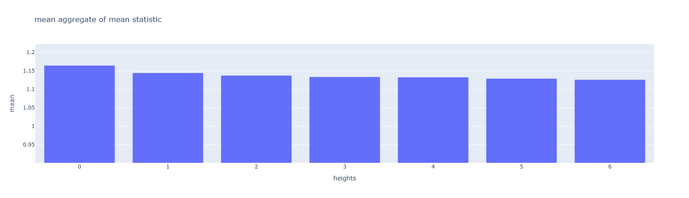

As we can see, by looking at the mean aggregate, it seems like the trend still holds even for daily granularuity, however, the range is much smaller.

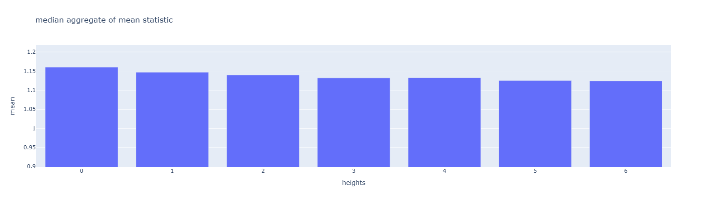

With the median aggregate, there is a small bump from 3 to 4, but overall the trend still holds, but it is still much weaker than at monthly granularity.

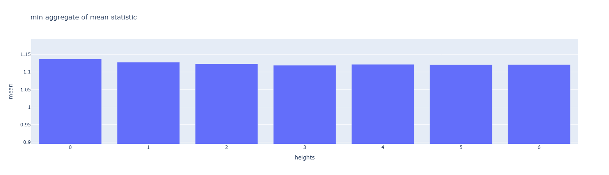

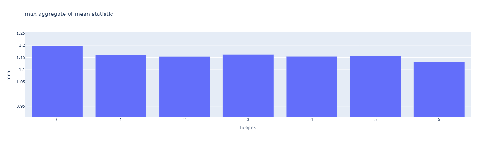

When looking at the maximum or minimum aggregate, the trend does start to fall apart, which hints at the fact that at daily granularity this improvement by having more and more hierarchy levels is not as significant, and also inconsistent.

Next we look at the percentage of how many height increase steps follow the suspected trend per each group. For example, a value of 50% for a group would mean that during the aggregation level drawing process, exactly half of the error statistic values produced by the draws followed the trend (i.e. increased or decreased by having more levels)

For the monthly mean NRMSE, these conformism percentages of the groups are: $$(83.33, 100.00, 100.00, 83.33, 100.00, 83.33, 100.00, 100.00, 100.00, 100.00)$$ This suggests that there were only three groups where there was a single step which was incosistent with the trend.

For the daily mean NRMSE, these conformism percentages of the groups are: $$(50.00, 50.00, 33.33, 83.33, 66.67, 66.67, 83.33, 83.33, 66.67, 66.67)$$ This data shows a much weaker trend, which is not very consistent, though still mostly true for more than half the aggregation level increase steps.

In conclusion, the trend does seem correct for top level error, and it might be true (but weaker) for bottom level error.

### Median trend analysis

Next we investigate the movement of the median of NRMSE errors of all unique sampled hierarchies. We start by looking at the matrices again.

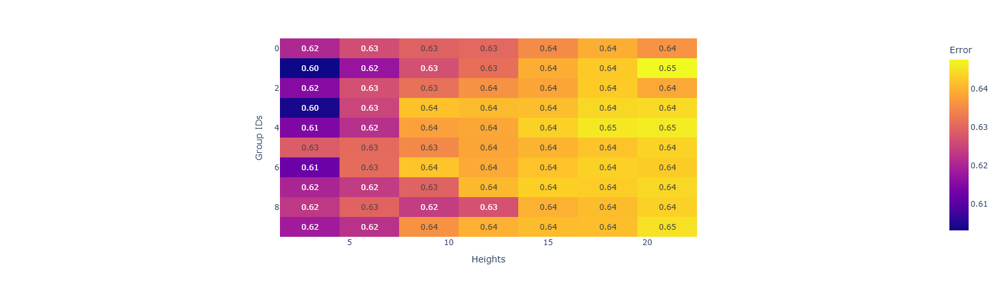

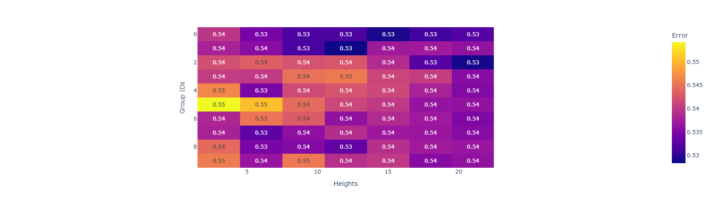

We can see that at daily granularity the suspected increasing trend does seem to hold up fairly consistently. At monthly granularity, the colors seem all over the place, hinting at the false suspicion of the trend. However we can see from the actual values at both granularities, that there is not much variance in the values at all, though there is a bigger change at daily granularity.

Next we look at aggregates of the median values, similarly as before.

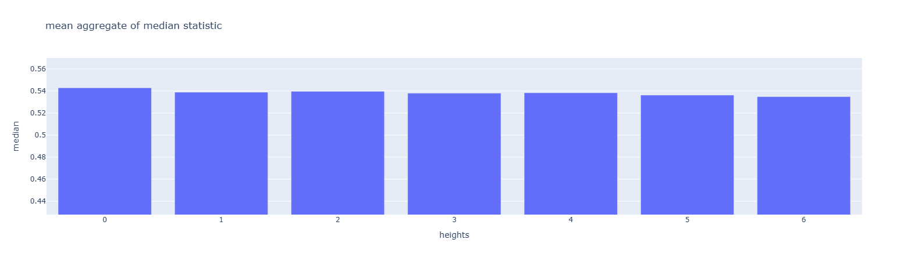

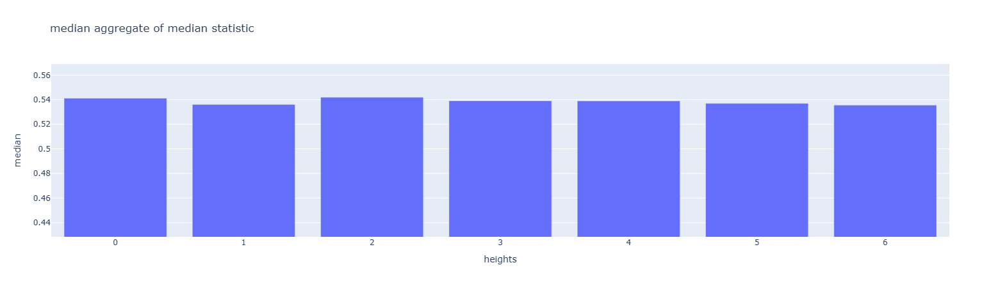

Looking at the mean aggregate of the median statistics as monthly granularity, it seems like the trend could be true, but even so it would be a very slight trend (i.e. there is little range in the values). The median aggregate shows no promise either, but there the small differences are inconsistent as well.

Next we look at the daily granularity median error aggregates

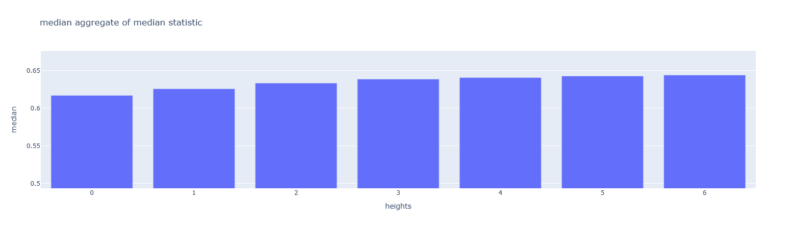

Looking at the mean and median aggregate of the median statistic of daily errors, the trend we suspected does seem true.

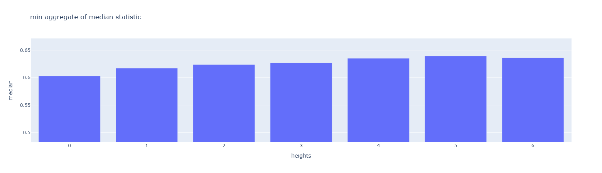

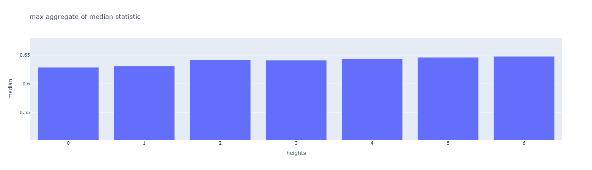

When looking at the minimum and maximum aggregates, the results are promising, showing a trend of increasing maximum and minimum median error, with slight variation.

Let us look at the conformism percentages of the individual hierarchy groups. At monthly granularity, these values are $$(50.00,33.33,33.33,33.33,33.33,0.00,33.33,33.33,33.33,50.00)$$ This shows that the opposite of our suspected trend might even hold up better, which would mean decreasing top level median error, but we have seen that the range of values are so little that we should not derive much from them.

For daily granularity the conformism scores are $$(83.33, 100.00, 83.33, 83.33, 100.00, 100.00, 66.67, 83.33, 83.33, 100.00)$$ Which suggests that for bottom level/daily granularity our suspected trend does seem to hold up well enough.

### Conclusions about suspected trends

We have further proved the following trends true (from strongest to weakest trend):

- Monthly mean NRMSE error decreasing
- Daily median NRMSE error increasing
- Daily mean NRMSE error decreasing

The following trend shall be considered false

- Monthly median NRMSE error increasing

In the next chapter, a theorem will be proven mathematically which might explain our findings. After the proof, in the conclusions, the reasons for why the theorem does not 100% hold up in practice will be discussed.

\newpage
